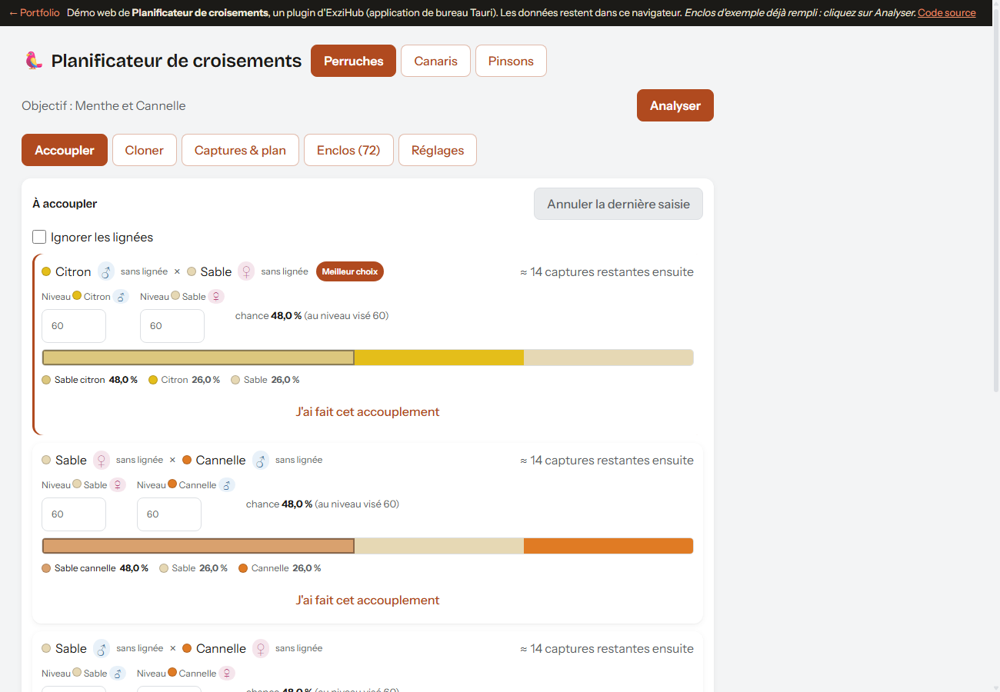

# Planificateur de croisements : planifier par la simulation

**[▶ Essayer la démo](https://exzitech.github.io/planificateur-croisements/)** · TypeScript · React · Web Worker · Vitest



Un outil d'aide à la décision : à partir d'un stock (un « enclos » d'animaux aux
couleurs héritées), il dit **quels couples accoupler, quoi recycler et combien
d'individus de base acquérir** pour atteindre une cible, en limitant l'effort.
Le problème est classique : **optimiser une suite de décisions dont le résultat est
aléatoire**. Les espèces de la démo (perruches, canaris, pinsons) et leurs couleurs
sont un habillage fictif : le moteur ne dépend d'aucun domaine particulier.

## Le problème

Chaque accouplement donne un résultat probabiliste, qui dépend du niveau des
parents et de leur lignée (couleurs des grands-parents). Les recettes s'enchaînent
sur 10 générations. Décider à l'intuition fait perdre des semaines.

## L'approche

- **Modèle probabiliste calibré sur le réel.** Deux relevés réels, tirés de
  l'application d'origine, sont reproduits au centième de pourcent : c'est un test automatisé
  ([`tests/croisement.test.ts`](plugins/opti-elevage/tests/croisement.test.ts)). Les points non vérifiés sont documentés et
  modifiables par l'utilisateur, plutôt que présentés comme des certitudes.
- **Simulation de Monte-Carlo.** Chaque couple candidat est évalué sur des
  centaines de parties simulées jusqu'à l'objectif.
- **Common random numbers.** Tous les candidats sont joués sur *les mêmes graines*
  que la référence. L'écart mesuré vient donc du choix du couple, pas du hasard.
  Il faut beaucoup moins de parties pour départager deux options proches.
- **Déterministe et testable.** Un générateur pseudo-aléatoire à graine
  (mulberry32) garantit que deux analyses identiques donnent le même résultat.
- **Réactif.** L'analyse tourne dans un Web Worker, avec des échantillons ajustés
  à la taille du stock pour rester sous la seconde. L'interface ne se fige jamais.

## Architecture

```
plugins/opti-elevage/src/
  engine/     logique pure, sans React ni DOM : modèle, recettes, simulation, analyse
  worker/     l'analyse hors du fil principal
  store/      état, persistance, migrations de format
  ui/         écrans React
tests/        63 tests Vitest sur le moteur (modèle, simulation, migrations...)
```

Toute la logique est dans `engine/` : on peut la tester et la réutiliser sans
interface. Les formats de données ont des migrations testées, pour que les
enclos des utilisateurs ne soient jamais perdus d'une version à l'autre.

## Lancer en local

```
npm install
npm run dev     # l'application avec rechargement à chaud
npm test        # les 63 tests
npm run build   # la version statique dans dist/
```

## Contexte

C'est l'un des plugins d'[ExziHub](https://github.com/Exzitech), une application
de bureau (Tauri) dont chaque outil s'installe et se met à jour à la demande.
Cette démo le fait tourner seul dans le navigateur ; les données restent en local.
Le détail du modèle est dans [plugins/opti-elevage/README.md](plugins/opti-elevage/README.md).

Licence MIT.
